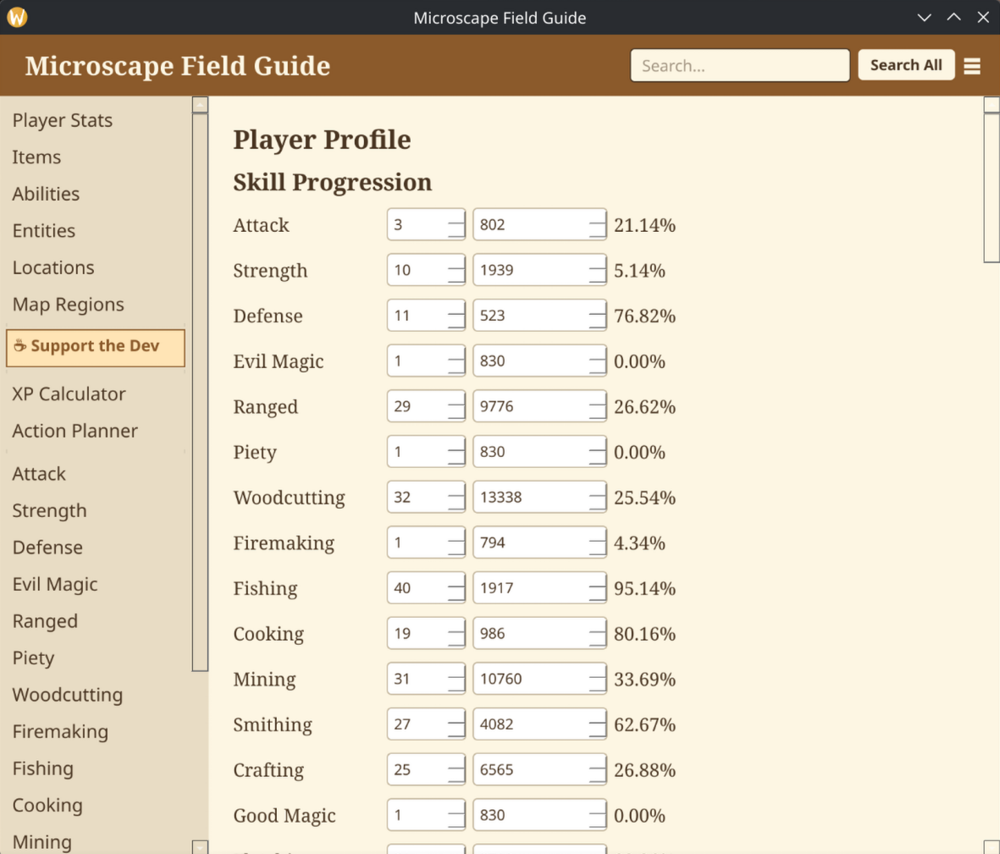
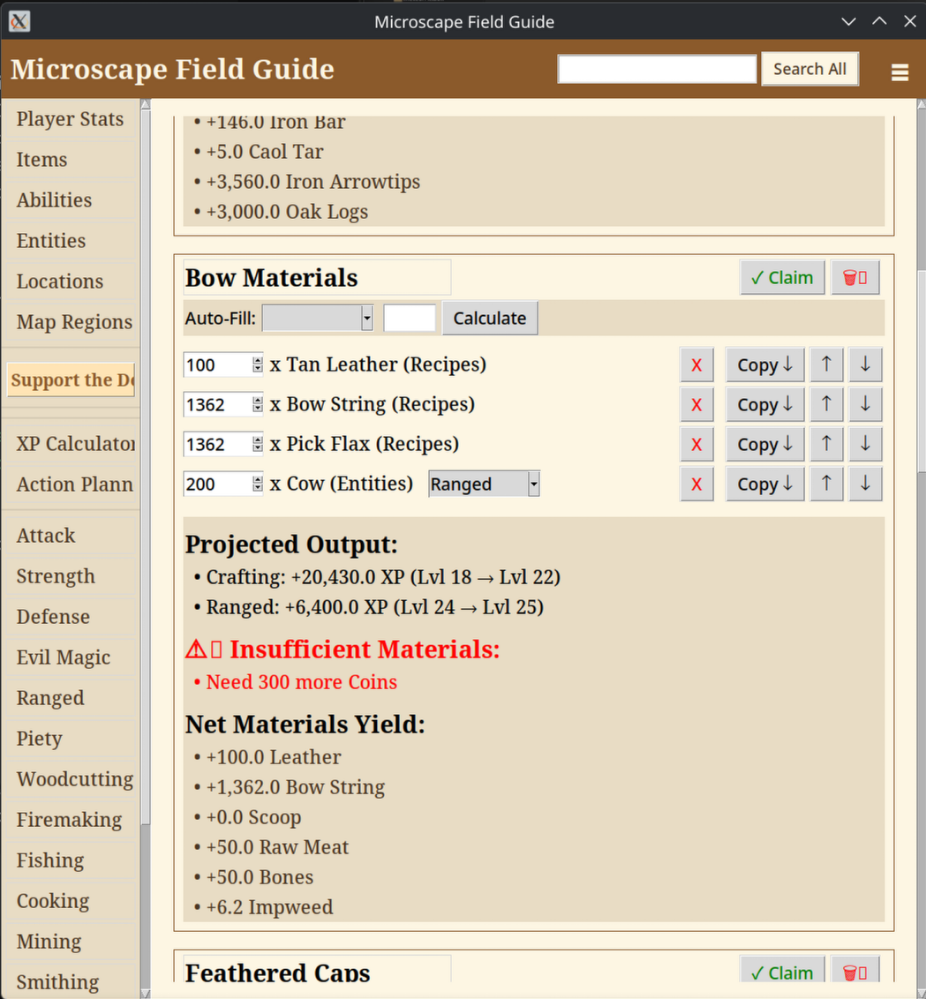
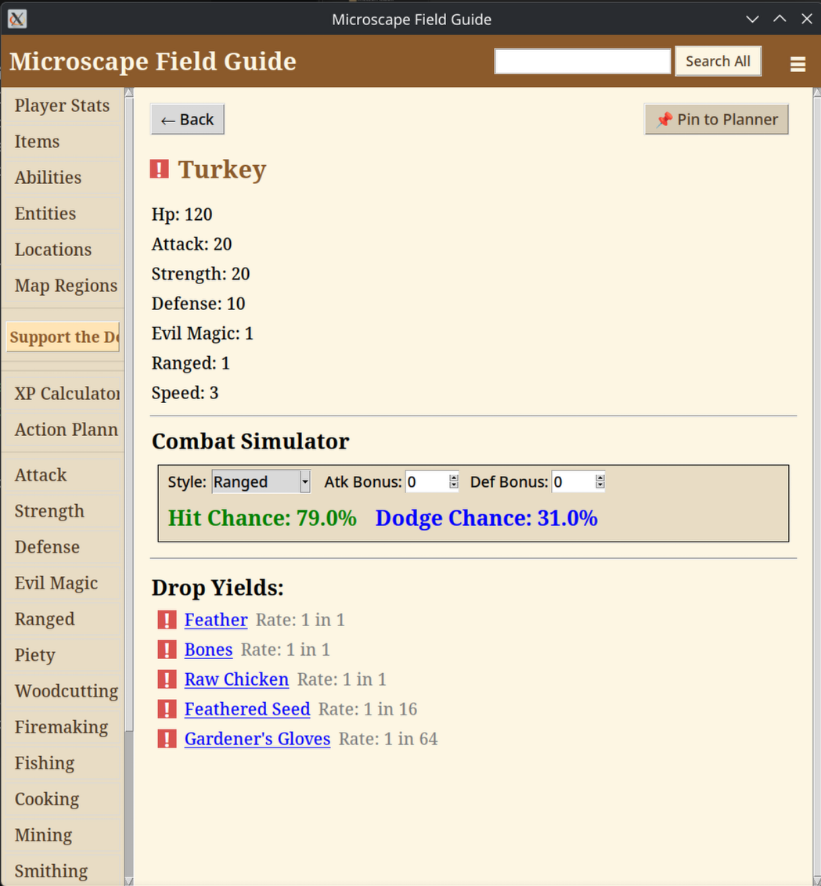

# 🗺️ Microscape Field Guide

A blazing-fast, offline companion application designed specifically for Microscape. 

The Field Guide is built to completely eliminate the guesswork from your grinds. Whether you are mapping out a complex production chain, calculating precise material deficits, or simulating combat odds before engaging a boss, this tool provides the exact, unscaled numbers you need to optimize your playtime.

*(Screenshot: The main dashboard showing the Action Planner and profile tracking)*

## ✨ Features

* **🛠️ Action Planner:** Map out your tasks, calculate exact material deficits or surpluses, and project your total XP gains before you start grinding. Includes recursive production batching for complex supply chains.
* **⚔️ Combat Simulator:** Instantly calculate your exact Hit and Dodge odds against specific entities based on your current gear and stats.
* **📚 Deep-Dive Database:** Cross-reference every item, recipe, drop table, and location. Navigate the database using clean, clickable links to trace where items come from and what they are used for.
* **📈 Profile Tracking:** Keep your current levels and abilities synced within the app to power the calculators and provide personalized recommendations.
* **⚡ 100% Offline:** Standalone architecture. No installation required, no forced web-calls, and zero latency.

## 🚀 Getting Started

The application is fully compiled and does not require Python or any external dependencies to run.

### Installation

1. Navigate to the [Releases page](../../releases/latest).
2. Download the executable for your operating system (Windows `.exe` or the Linux binary).
3. Place the file in a dedicated folder on your computer (e.g., `Documents/Microscape Guide`).
4. Run the application.

*Note: On its first launch, the Field Guide will automatically unpack its local database right next to the executable. Keeping it in its own folder keeps your files clean!*

### Updating
When a new version is released, simply download the new executable and replace your old one. Your local database and profile settings will remain intact and will be seamlessly picked up by the new version.

## 📸 Screenshots

| Action Planner | Combat Simulator |
| :---: | :---: |
|  |  |
| *Calculate exact deficits and XP pipelines.* | *Simulate true drop rates and combat odds.* |

## 🛡️ Security & Privacy

Because this tool is a compiled executable, Windows SmartScreen or other antivirus software may flag it simply because it is an "unknown" file from an indie developer. This is normal. 

* The application operates entirely offline. 
* It does not transmit your profile data anywhere.
* The source code is actively maintained and all database information is parsed directly from the game's raw data for unscaled accuracy.

## 🤝 Feedback & Support

If you run into any bugs, have feature requests, or notice any database discrepancies, please open an issue here on GitHub!

If this tool helped you secure that pet drop or optimize your 99 grind, consider leaving a tip to help keep the coffee flowing during development!
 

---
*Disclaimer: Microscape Field Guide is an unofficial companion app and is not affiliated with the developers of Microscape.*
